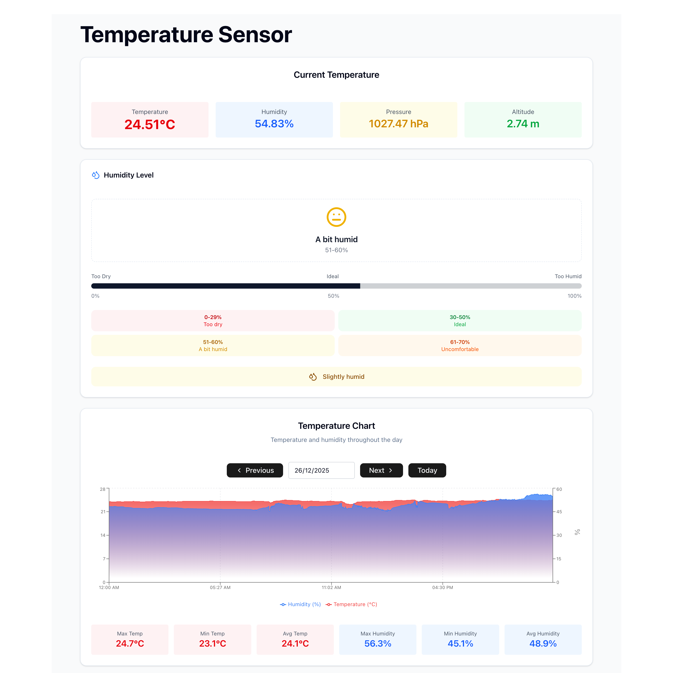

# Smart Temperature & Humidity Monitor

A real-time environmental monitoring dashboard built with React, Capacitor, and Firebase, powered by an ESP32 and a BME280 sensor. This application provides live readings of temperature, humidity, pressure, and altitude, alongside historical data visualization for precise climate tracking.

## Tech Stack

* **Hardware:** Seeed Xiao ESP32-C3 + BME280 Sensor (I2C).
* **Firmware:** Arduino / C++ (Firebase-ESP-Client & Adafruit BME280).
* **UI:** React.js
* **Mobile:** Capacitor (iOS/Android).
* **Database:** Firebase Realtime Database.

---

